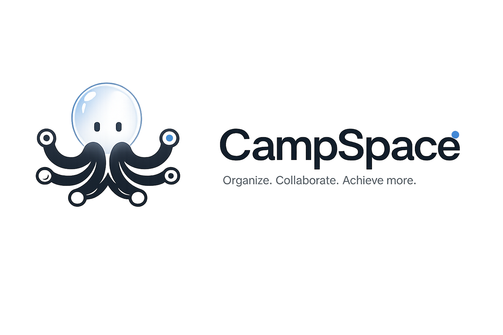

<div align="center">



# CampSpace

### Organize. Collaborate. Achieve more.

A modern all-in-one collaborative workspace built for students.

</div>

---

## 🚀 Overview

CampSpace is a collaborative operating system for students that combines project management, coding, communication, notes, scheduling, and productivity into a single platform.

Instead of switching between multiple applications, students can manage everything from one workspace.

---

## ✨ Features

- 📚 Academic Workspace
- 👥 Team Collaboration
- 💬 Real-time Chat
- 📝 Shared Notes
- 📅 Calendar & Deadlines
- 📌 Kanban Boards
- 📂 File Sharing
- 💻 VS Code Integration
- 🌐 Git & GitHub Integration
- 🔔 Notifications
- 📊 Dashboard & Analytics

---

## 🛠️ Tech Stack

### Frontend

- React
- Tailwind CSS
- TypeScript

### Backend

- Node.js
- Express.js

### Database

- PostgreSQL
- Prisma ORM

### Authentication

- JWT
- OAuth

### Realtime

- Socket.IO

---

## 📂 Project Structure

```
frontend/
backend/
docs/
assets/
```

---

## 👥 Team

| Name | Role |
|------|------|
| Your Name | Project Lead |
| Member 2 | Frontend |
| Member 3 | Backend |

---

## 🎯 Vision

To create the ultimate digital campus workspace where students can:

- Learn
- Build
- Collaborate
- Manage projects
- Communicate
- Grow together

---

## 📸 Preview

Coming Soon...

---

## 📄 License

Private Repository © 2026 CampSpace Team
